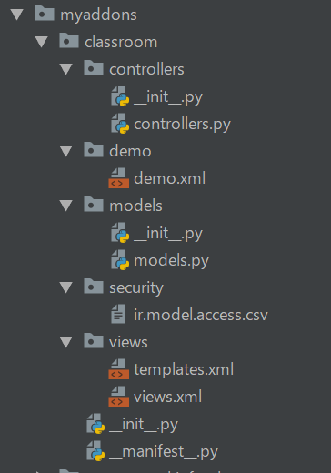

# 在odoo 中新创建一个模块

## 使用脚手架创建模块

```shell
python odoo-bin scaffold 模块名  目录名
python odoo-bin scaffold classroom  myaddons
```

`注意点`：

+ 最好制定文件路径，如果不指定文件路径会在根目录下
+ 确保激活了venv
+ 模块的名用小写

## 生成默认文件目录

```html
projectName
│
└───controllers
│      __init__.py
│      controllers.py
└───demo
│      demo.xml
└───models
│     __init__.py
│      models.py
└───security
│     ir.model.access.csv
└───views
│      templates.xml
│      views.xml
└───
    __manifest__.py
    __init__.py
```



## 各个模块作用

+ `controllers`
处理http请求的
+ `demo`
模块安装是的demo数据
+ `models`
一般映射到数据中
+ `security`
安全文件的定义
+ `views`
视图层
+ `__manifest__.py`
文件的定义文件
